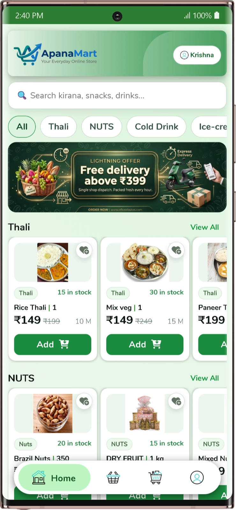
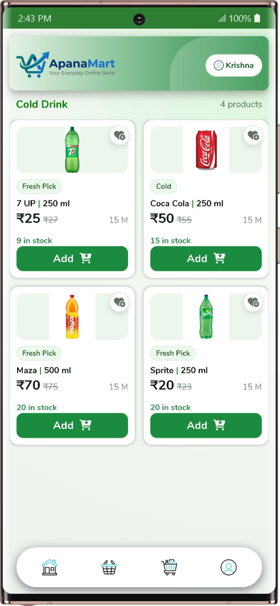
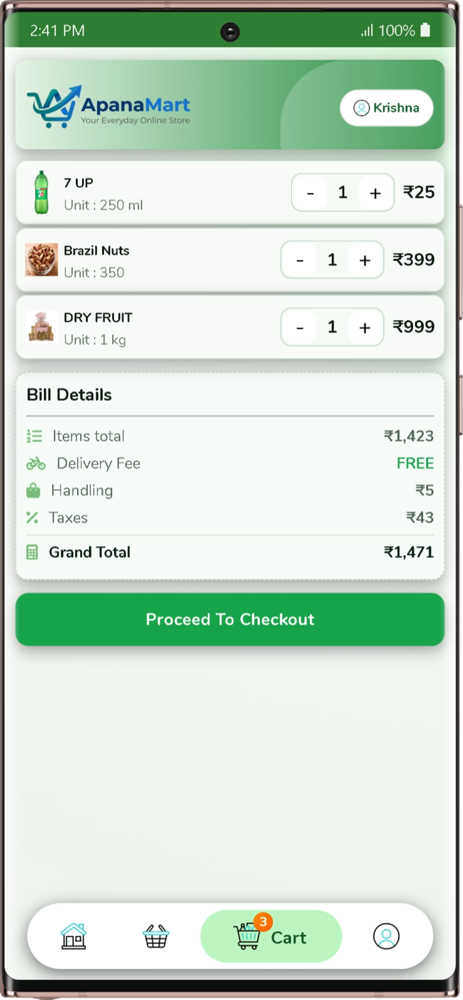
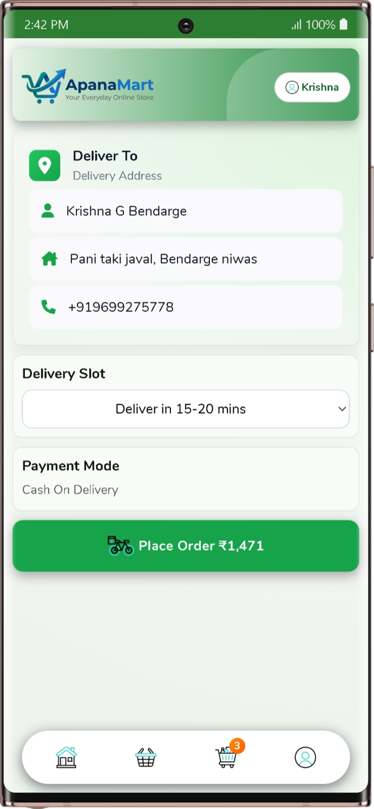
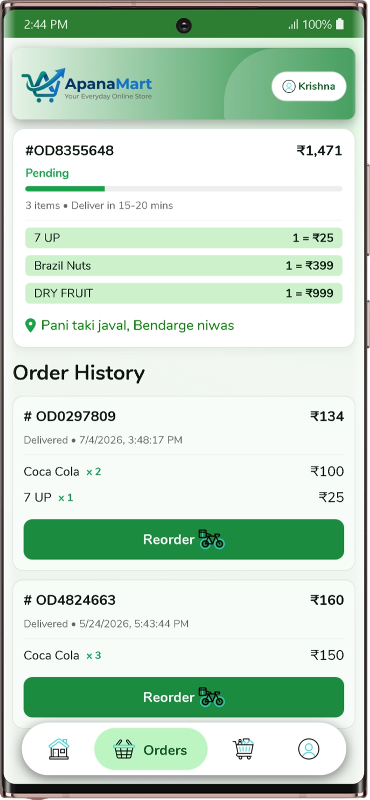
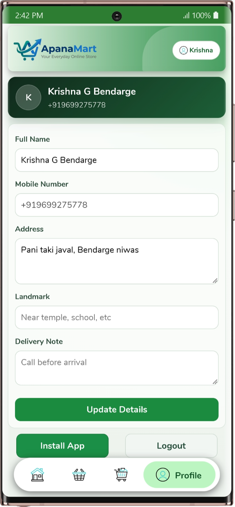
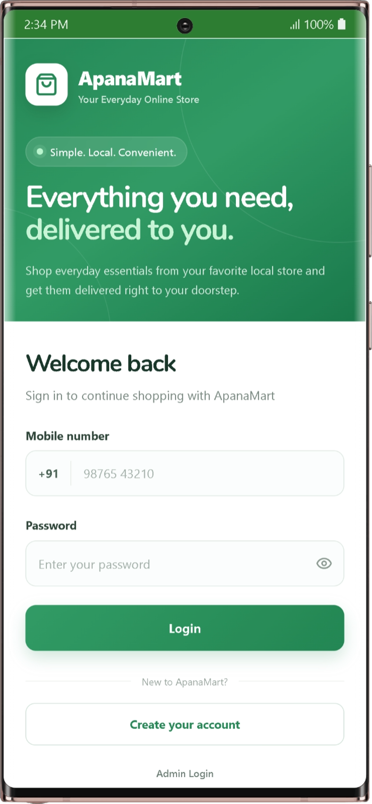
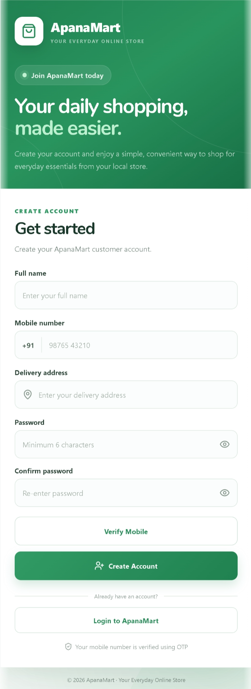
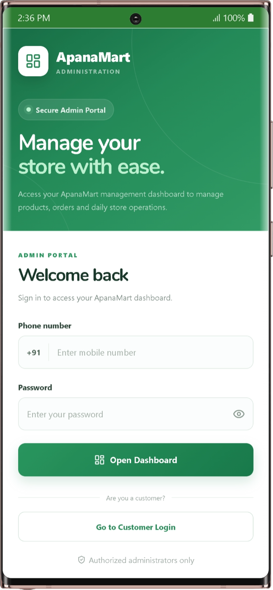

from pathlib import Path
import shutil
import zipfile

# Regenerate the README to match the user's actual GitHub structure:
# README.md at root + Images/ at root, with no docs/ folder.
root = Path("/mnt/data/apnamart-readme-root-images")
images = root / "Images"
images.mkdir(parents=True, exist_ok=True)

source_images = {
    "homePage.png": "/mnt/data/homePage.png",
    "categoryPage.png": "/mnt/data/categoryPage.png",
    "cardPage.png": "/mnt/data/cardPage.png",
    "checkOutPage.png": "/mnt/data/checkOutPage.png",
    "ordersPage.png": "/mnt/data/ordersPage.png",
    "profilePage.png": "/mnt/data/profilePage.png",
    "loginPage.png": "/mnt/data/loginPage.png",
    "accountCreate.png": "/mnt/data/accountCreate.png",
    "adminLogin.png": "/mnt/data/adminLogin.png",
}

for filename, source in source_images.items():
    shutil.copy2(source, images / filename)

readme = r'''# 🛒 ApnaMart

> **Your Everyday Online Store**  
> A modern React-based e-commerce application designed to bring everyday local-store shopping online through a simple, responsive, and convenient digital experience.


---

## 📑 Table of Contents

- [About ApnaMart](#-about-apnamart)
- [Problem Statement](#-problem-statement)
- [Objectives](#-objectives)
- [Key Features](#-key-features)
- [Application Flow](#-application-flow)
- [Application Screenshots](#-application-screenshots)
- [Technology Stack](#-technology-stack)
- [Firebase Realtime Database](#-firebase-realtime-database)
- [MSG91 OTP Verification](#-msg91-otp-verification)
- [Customer Shopping Flow](#-customer-shopping-flow)
- [Admin Portal](#-admin-portal)
- [Project Structure](#-project-structure)
- [Installation](#-installation)
- [Environment Variables](#-environment-variables)
- [Firebase Configuration](#-firebase-configuration)
- [MSG91 Configuration](#-msg91-configuration)
- [Run Locally](#-run-locally)
- [Production Build](#-production-build)
- [Deployment](#-deployment)
- [Security](#-security)
- [Future Enhancements](#-future-enhancements)
- [Contributing](#-contributing)
- [License](#-license)
- [Author](#-author)

---

## 🛍️ About ApnaMart

**ApnaMart** is a React-based e-commerce web application focused on making everyday shopping simple and convenient.

Customers can browse products, search categories, add products to a cart, review the bill, provide delivery information, place orders, view order history, reorder previous purchases, and manage their profile.

The project also provides a separate administration entry point for store operations.

### Project Vision

> **Simple. Local. Convenient.**

ApnaMart aims to provide a clean digital shopping experience for customers while giving a local store a foundation for managing products and orders digitally.

---

## ❓ Problem Statement

Traditional local-store shopping may require customers to physically visit the shop, search manually for products, calculate purchases, and repeatedly provide delivery details.

ApnaMart provides a digital workflow where customers can:

- Browse products online.
- Search products and categories.
- Check prices and stock availability.
- Add multiple products to a cart.
- Review the complete bill.
- Enter delivery information.
- Select a delivery slot.
- Place an order.
- View previous orders.
- Reorder previously purchased products.

---

## 🎯 Objectives

The main objectives of ApnaMart are:

- Build a modern online shopping interface.
- Digitize everyday local-store product browsing.
- Provide category-based product discovery.
- Make cart management simple.
- Provide a clear checkout process.
- Store application data using Firebase Realtime Database.
- Provide mobile-number OTP verification using MSG91.
- Allow customers to manage their profile and delivery details.
- Maintain order history.
- Provide reorder functionality.
- Provide a separate admin login interface.
- Maintain a responsive and mobile-friendly UI.

---

# ✨ Key Features

## 👤 Customer Features

### Account Management

- Customer registration.
- Customer login.
- Mobile number verification.
- MSG91 OTP verification.
- Customer profile.
- Address management.
- Landmark information.
- Delivery note.
- Logout.

### 🏠 Product Discovery

- Home page.
- Product search.
- Category filters.
- Product categories.
- Product cards.
- Product images.
- Current price.
- Previous price.
- Stock availability.
- Product unit information.
- Add to cart.
- Favorite/shortcut action.

### 🛒 Shopping Cart

- Cart item listing.
- Quantity increment/decrement.
- Product price calculation.
- Items total.
- Delivery fee.
- Handling charges.
- Taxes.
- Grand total.
- Cart item count.
- Checkout button.

### 📦 Checkout

- Customer delivery information.
- Name.
- Address.
- Mobile number.
- Delivery slot.
- Payment mode.
- Final order amount.
- Place Order action.

### 📋 Orders

- Current order.
- Order ID.
- Order amount.
- Order status.
- Delivery estimate.
- Ordered items.
- Delivery address.
- Previous orders.
- Order date/time.
- Reorder functionality.

### 👤 Profile

- Full name.
- Mobile number.
- Address.
- Landmark.
- Delivery note.
- Update details.
- Install App option where supported.
- Logout.

### 👨‍💼 Administration

- Dedicated admin login.
- Admin mobile number.
- Admin password.
- Separate dashboard entry point.
- Customer login navigation.

---

# 🔄 Application Flow

```text
                         ┌─────────────────┐
                         │    ApnaMart     │
                         └────────┬────────┘
                                  │
                   ┌──────────────┴──────────────┐
                   │                             │
             Existing User                 New Customer
                   │                             │
                   ▼                             ▼
              Login Page                  Create Account
                   │                             │
                   │                       MSG91 OTP
                   │                             │
                   └──────────────┬──────────────┘
                                  ▼
                              Home Page
                                  │
                    ┌─────────────┼─────────────┐
                    │             │             │
                    ▼             ▼             ▼
                 Search       Categories     Products
                    │             │             │
                    └─────────────┼─────────────┘
                                  ▼
                                Cart
                                  │
                                  ▼
                              Checkout
                                  │
                                  ▼
                            Place Order
                                  │
                                  ▼
                            Order History
                                  │
                                  ▼
                              Reorder
```

---

# 📸 Application Screenshots

All application screenshots are stored directly inside the repository's **`Images/`** folder.

```text
ApnaMart/
├── README.md
└── Images/
    ├── homePage.png
    ├── categoryPage.png
    ├── cardPage.png
    ├── checkOutPage.png
    ├── ordersPage.png
    ├── profilePage.png
    ├── loginPage.png
    ├── accountCreate.png
    └── adminLogin.png
```

---

## 1. 🏠 Home Page

The Home Page is the main shopping interface.

It contains:

- Product search.
- Category navigation.
- Promotional banner.
- Product sections.
- Product stock information.
- Product prices.
- Add-to-cart buttons.
- Bottom navigation.
- Customer profile access.
---

## 2. 🥤 Category / Product Listing

The category page displays products belonging to a selected category.

The current design includes:

- Category name.
- Product count.
- Product image.
- Product label.
- Current price.
- Previous price.
- Stock availability.
- Product unit.
- Add button.
- Favorite action.
- Bottom navigation.
---

## 3. 🛒 Cart

The Cart page lets customers review their selected products.

It includes:

- Product image.
- Product name.
- Product unit.
- Quantity controls.
- Product price.
- Items total.
- Delivery fee.
- Handling charge.
- Taxes.
- Grand total.
- Proceed to Checkout button.
- Cart item count.


---

## 4. 📦 Checkout

The Checkout page collects the information required before placing an order.

### Delivery Information

- Customer name.
- Delivery address.
- Mobile number.

### Delivery

- Delivery slot selection.

### Payment

- Payment mode.

### Confirmation

- Final order amount.
- Place Order button.
---

## 5. 📋 Order History

The Orders page provides the customer's order information.

It includes:

- Current order.
- Order ID.
- Order amount.
- Order status.
- Delivery estimate.
- Ordered products.
- Delivery address.
- Previous orders.
- Order date/time.
- Reorder button.

---

## 6. 👤 Profile

The Profile page allows customers to manage their personal and delivery information.

Available fields include:

- Full Name.
- Mobile Number.
- Address.
- Landmark.
- Delivery Note.

Actions include:

- Update Details.
- Install App.
- Logout.


---

## 7. 🔐 Customer Login

The Customer Login page provides access to an existing account.

It includes:

- Mobile number.
- Password.
- Password visibility control.
- Login button.
- Create Account navigation.
- Admin Login navigation.


---

## 8. 📝 Create Account

New customers can create an ApnaMart account.

Registration fields include:

- Full name.
- Mobile number.
- Delivery address.
- Password.
- Confirm password.

The page also provides:

- Mobile verification.
- OTP verification.
- Create Account.
- Login navigation.


---

## 9. 👨‍💼 Admin Login

ApnaMart provides a separate administration login interface.

It contains:

- ApnaMart administration branding.
- Secure Admin Portal indicator.
- Mobile number.
- Password.
- Password visibility control.
- Open Dashboard button.
- Customer Login navigation.
- Authorized administrator notice.


---

# 🧰 Technology Stack

| Technology | Purpose |
|---|---|
| **React.js** | Component-based frontend application |
| **JavaScript** | Application logic and interactivity |
| **HTML5** | Application structure |
| **CSS3** | Styling and responsive UI |
| **Firebase Console** | Firebase project configuration |
| **Firebase Realtime Database** | Real-time application data |
| **MSG91** | Mobile OTP verification |
| **Vite** | Development server and build tooling |

---

# 🔥 Firebase Realtime Database

ApnaMart uses **Firebase Realtime Database** for application data.

A conceptual database structure can be organized as:

```text
Firebase Realtime Database
│
├── users/
│   └── userId/
│       ├── name
│       ├── mobile
│       ├── address
│       ├── landmark
│       └── deliveryNote
│
├── products/
│   └── productId/
│       ├── name
│       ├── category
│       ├── price
│       ├── oldPrice
│       ├── unit
│       ├── stock
│       └── image
│
├── categories/
│
└── orders/
    └── orderId/
        ├── userId
        ├── items
        ├── total
        ├── status
        ├── address
        ├── deliverySlot
        └── createdAt
```

> The exact paths and fields should match your implementation. This structure is provided as documentation guidance.

---

# 📱 MSG91 OTP Verification

MSG91 is used for mobile-number OTP verification during the customer registration process.

```text
Customer
    │
    ▼
Create Account
    │
    ├── Full Name
    ├── Mobile Number
    ├── Address
    ├── Password
    └── Confirm Password
    │
    ▼
Verify Mobile
    │
    ▼
MSG91 OTP
    │
    ▼
OTP Verification
    │
    ▼
Account Creation
```

This helps add an additional mobile verification step to customer registration.

---

# 🛒 Customer Shopping Flow

### 1. Browse Products

The customer opens the Home Page and browses categories or searches for products.

### 2. Select Products

Each product provides information such as:

- Product name.
- Unit.
- Price.
- Previous price.
- Stock.
- Product image.

### 3. Add to Cart

The customer adds required products to the cart.

### 4. Manage Cart

The customer can increase/decrease quantities and review:

```text
Items Total
+ Delivery Fee
+ Handling
+ Taxes
----------------
Grand Total
```

### 5. Checkout

The customer verifies delivery details and selects a delivery slot/payment mode.

### 6. Place Order

The customer confirms the order.

### 7. Order History

The customer can view previous orders and use the reorder option.

---

# 👨‍💼 Admin Portal

ApnaMart has a separate administration entry point.

The Admin Login screen is designed separately from the customer authentication flow.

The administration area is intended for store operations such as:

- Product management.
- Order management.
- Store data management.
- Daily store operations.

The exact dashboard capabilities depend on the admin implementation in the project.

---

# 📁 Project Structure

Based on the repository structure, the project is organized around:

```text
ApnaMart/
│
├── Images/
│   ├── homePage.png
│   ├── categoryPage.png
│   ├── cardPage.png
│   ├── checkOutPage.png
│   ├── ordersPage.png
│   ├── profilePage.png
│   ├── loginPage.png
│   ├── accountCreate.png
│   └── adminLogin.png
│
├── public/
│
├── src/
│
├── .env.example
├── .gitattributes
├── .gitignore
├── README.md
├── eslint.config.js
├── index.html
├── package.json
├── package-lock.json
└── vite.config.js
```

---

# 🚀 Installation

## 1. Clone the Repository

```bash
git clone https://github.com/MareoCraft/ApnaMart.git
cd ApnaMart
```

## 2. Install Dependencies

```bash
npm install
```

## 3. Configure Environment Variables

Create your local environment file based on `.env.example`.

```bash
cp .env.example .env
```

On Windows, you can create/copy the file manually if the command above is unavailable.

## 4. Start the Application

```bash
npm run dev
```

---

# ⚙️ Environment Variables

Do not commit private secrets to GitHub.

Your project can use an environment configuration similar to:

```env
VITE_FIREBASE_API_KEY=your_api_key
VITE_FIREBASE_AUTH_DOMAIN=your_project.firebaseapp.com
VITE_FIREBASE_DATABASE_URL=your_database_url
VITE_FIREBASE_PROJECT_ID=your_project_id
VITE_FIREBASE_STORAGE_BUCKET=your_storage_bucket
VITE_FIREBASE_MESSAGING_SENDER_ID=your_sender_id
VITE_FIREBASE_APP_ID=your_app_id

# MSG91
VITE_MSG91_CONFIG=your_msg91_configuration
```

Use the exact variable names required by your source code.

---

# 🔥 Firebase Configuration

1. Open Firebase Console.
2. Create or select your Firebase project.
3. Register the web application.
4. Configure Firebase Realtime Database.
5. Configure the authentication/data services used by the application.
6. Add the Firebase configuration to your environment.
7. Configure database security rules.
8. Test the application locally.

### Important

Avoid unrestricted production rules such as:

```json
{
  "rules": {
    ".read": true,
    ".write": true
  }
}
```

Use rules that restrict access according to your application roles and authentication model.

---

# 📲 MSG91 Configuration

To configure OTP verification:

1. Create/configure your MSG91 account.
2. Configure the OTP service/template.
3. Configure required sender/template settings.
4. Connect the OTP flow to customer registration.
5. Add the required configuration to your environment.
6. Test OTP delivery.

Never publish private API credentials or sensitive tokens in the GitHub repository.

---

# 💻 Run Locally

Start the Vite development server:

```bash
npm run dev
```

Then open the local URL shown by Vite.

---

# 📦 Production Build

Build the application:

```bash
npm run build
```

Preview the production build:

```bash
npm run preview
```

The production output is generated in:

```text
dist/
```

---

# 🌐 Deployment

Typical deployment process:

```text
Source Code
     │
     ▼
npm install
     │
     ▼
npm run build
     │
     ▼
dist/
     │
     ▼
Hosting Platform
     │
     ▼
Live ApnaMart
```

Before deployment, verify:

- Production environment variables.
- Firebase database configuration.
- Firebase security rules.
- MSG91 configuration.
- SPA routing.
- Production API/service configuration.

---

# 🔐 Security

For production use:

- Keep `.env` files out of Git.
- Use `.gitignore` for local secrets.
- Configure Firebase Security Rules.
- Restrict administrative operations.
- Validate user input.
- Protect customer information.
- Avoid exposing private service credentials.
- Use HTTPS.
- Do not depend only on frontend validation for security.
- Review database permissions before deployment.

---

# 🚧 Future Enhancements

Possible future improvements:

- [ ] Advanced product search.
- [ ] Product details page.
- [ ] Advanced category filtering.
- [ ] Real-time order tracking.
- [ ] Inventory management.
- [ ] Low-stock alerts.
- [ ] Order cancellation.
- [ ] Multiple delivery addresses.
- [ ] Improved payment integration.
- [ ] Product reviews and ratings.
- [ ] Coupon system.
- [ ] Sales analytics.
- [ ] Admin analytics dashboard.
- [ ] Order-status notifications.
- [ ] Accessibility improvements.
- [ ] Performance optimization.

---

# 🤝 Contributing

Contributions are welcome.

```bash
# Fork the repository

# Clone your fork
git clone https://github.com/YOUR_USERNAME/ApnaMart.git

cd ApnaMart

# Install dependencies
npm install

# Create a feature branch
git checkout -b feature/your-feature

# Start development
npm run dev
```

After making changes:

```bash
git add .
git commit -m "Add: your feature"
git push origin feature/your-feature
```

Then open a Pull Request.

---

# 📄 License

No specific license was provided in the current repository information.

If you want to release the project under an open-source license, add the chosen license file to the repository and update this section accordingly.

---

# 👨‍💻 Author

## Prathamesh G. Bendarge

**ApnaMart — Your Everyday Online Store**

Built using:

```text
React.js
JavaScript
HTML5
CSS3
Firebase Realtime Database
MSG91
Vite
```

---

<p align="center">

### 🛒 ApnaMart

**Your Everyday Online Store**

<div align="center">

  
  
  

  <br>

  <b>Home</b>
  &nbsp;&nbsp;&nbsp;&nbsp;&nbsp;&nbsp;&nbsp;
  <b>Category</b>
  &nbsp;&nbsp;&nbsp;&nbsp;&nbsp;&nbsp;&nbsp;
  <b>Cart</b>

  <br><br>

  
  
  

  <br>

  <b>Checkout</b>
  &nbsp;&nbsp;&nbsp;&nbsp;&nbsp;
  <b>Orders</b>
  &nbsp;&nbsp;&nbsp;&nbsp;&nbsp;
  <b>Profile</b>

  <br><br>

  
  
  

  <br>

  <b>Login</b>
  &nbsp;&nbsp;&nbsp;&nbsp;&nbsp;&nbsp;&nbsp;&nbsp;
  <b>Create Account</b>
  &nbsp;&nbsp;&nbsp;&nbsp;&nbsp;
  <b>Admin Login</b>

</div>
